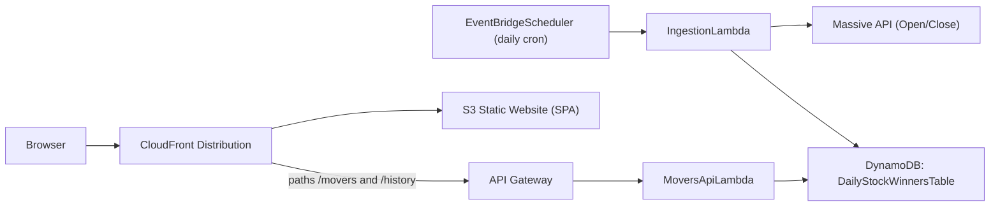

# Stocks Serverless Pipeline

Serverless stock-mover dashboard built for the "Stocks Serverless Pipeline" challenge.
The system runs daily, fetches open/close data for a fixed watchlist, identifies the
largest absolute percent mover, stores results in DynamoDB, and serves the last 7 market
days via a REST API and a public SPA.

## Requirements Coverage (PDF -> Repo)

- **IaC only (no manual console provisioning)**: Implemented with AWS CDK in
  [`infra/lib/infra-stack.ts`](infra/lib/infra-stack.ts) and validated with infra tests in
  [`infra/test/infra.test.ts`](infra/test/infra.test.ts).
- **Daily schedule (EventBridge cron family)**: Implemented using EventBridge Scheduler
  (`AWS::Scheduler::Schedule`) in [`infra/lib/infra-stack.ts`](infra/lib/infra-stack.ts).
- **Ingestion Lambda**:
  - Handler/orchestration: [`infra/lambda/ingestion/index.ts`](infra/lambda/ingestion/index.ts)
  - Watchlist: [`infra/lambda/ingestion/config.ts`](infra/lambda/ingestion/config.ts)
  - Percent math `((close - open) / open) * 100`:
    [`infra/lambda/ingestion/massiveApi.ts`](infra/lambda/ingestion/massiveApi.ts)
  - Absolute winner selection: [`infra/lambda/ingestion/dynamo.ts`](infra/lambda/ingestion/dynamo.ts)
  - Rate limit + retries:
    [`infra/lambda/ingestion/massiveRateLimiter.ts`](infra/lambda/ingestion/massiveRateLimiter.ts)
- **Storage in DynamoDB (date, symbol, % change, close)**:
  - Table + GSIs + TTL: [`infra/lib/infra-stack.ts`](infra/lib/infra-stack.ts)
  - Writes and item model: [`infra/lambda/ingestion/dynamo.ts`](infra/lambda/ingestion/dynamo.ts)
- **API layer (API Gateway + Lambda)**:
  - Routes (`GET /movers`, extra `GET /history`):
    [`infra/lib/infra-stack.ts`](infra/lib/infra-stack.ts)
  - Handler: [`infra/lambda/api/index.ts`](infra/lambda/api/index.ts)
  - Query logic (last 7 winners): [`infra/lambda/api/moversService.ts`](infra/lambda/api/moversService.ts)
- **Frontend SPA on AWS**:
  - React app: [`frontend/src/App.tsx`](frontend/src/App.tsx)
  - Winners table UI: [`frontend/src/views/WinnersView.tsx`](frontend/src/views/WinnersView.tsx)
  - Gain/loss color coding (green/red):
    [`frontend/src/views/viewStyles.ts`](frontend/src/views/viewStyles.ts)
  - Hosting: S3 static site + CloudFront in [`infra/lib/infra-stack.ts`](infra/lib/infra-stack.ts)
- **Security (no key commits)**:
  - `.env` ignored in [`.gitignore`](.gitignore)
  - Massive API key read from Secrets Manager at runtime in
    [`infra/lambda/ingestion/index.ts`](infra/lambda/ingestion/index.ts)
  - CI supports OIDC or repo secrets for AWS auth:
    [`.github/workflows/ci.yml`](.github/workflows/ci.yml)

## Architecture



## Watchlist and Data Model

Watchlist (configured in [`infra/lambda/ingestion/config.ts`](infra/lambda/ingestion/config.ts)):

- `AAPL`
- `MSFT`
- `GOOGL`
- `AMZN`
- `TSLA`
- `NVDA`

The ingestion Lambda stores one row per ticker per market date. Winner rows are flagged with
`isWinner: true` and indexed in `WinnersByDateIndex` for fast `/movers` queries.

Core fields per row:

- `date`
- `tickerSymbol`
- `percentChange`
- `closingPrice`
- `isWinner`
- `expiresAt` (TTL)

## API

### `GET /movers` (required)

Returns the last 7 market-day winners.

Response shape:

```json
{
  "data": [
    {
      "date": "2026-03-06",
      "tickerSymbol": "AAPL",
      "percentChange": 4.2,
      "closingPrice": 208.11
    }
  ]
}
```

### `GET /history` (extra endpoint)

Returns grouped daily data for chart views (7 complete market days).

Response shape:

```json
{
  "data": [
    {
      "date": "2026-03-06",
      "movers": [
        {
          "date": "2026-03-06",
          "tickerSymbol": "AAPL",
          "percentChange": 4.2,
          "closingPrice": 208.11,
          "isWinner": true
        }
      ]
    }
  ]
}
```

## Local Development

### Prerequisites

- Node.js 20+
- npm
- AWS credentials configured (only needed for CDK/deployed access)

### 1) Install dependencies

```bash
cd infra && npm install
cd ../frontend && npm install
```

### 2) Configure frontend API base URL

Copy [`frontend/.env.example`](frontend/.env.example) to `frontend/.env.local`:

```bash
VITE_API_BASE_URL=http://localhost:4000
```

### 3) Local API server (optional)

`infra` includes `npm run dev:api` (`ts-node lambda/api/local-server.ts`) to run the API logic
locally against an existing DynamoDB table.

Create a root `.env` file (repo root) with:

```bash
WINNERS_TABLE_NAME=<your_dynamodb_table_name>
LOCAL_API_PORT=4000
```

Run:

```bash
cd infra
npm run dev:api
```

### 4) Run frontend

```bash
cd frontend
npm run dev
```

## Deploy to AWS (CDK)

### Prerequisites

- AWS CLI configured
- CDK bootstrapped in target account/region (`cdk bootstrap`)
- Node.js 20+

### Deploy steps

1. Build frontend artifact (required before deploy):

   ```bash
   cd frontend
   npm run build
   ```

2. Deploy infrastructure:

   ```bash
   cd ../infra
   npm run build
   npx cdk deploy
   ```

3. Set Massive API key in Secrets Manager:
   - Secret name created by stack: `massive_api_secret`
   - Store the key under JSON field: `MASSIVE_API_KEY`

4. Trigger ingestion once (optional) so data appears immediately, or wait for daily schedule.

### CDK outputs

The stack outputs:

- `MoversApiUrl`
- `HistoryApiUrl`
- `MoversWebsiteUrl`
- `MoversCloudFrontUrl`

Use `MoversCloudFrontUrl` as the primary public URL.

## CI/CD

GitHub Actions workflow: [`.github/workflows/ci.yml`](.github/workflows/ci.yml)

- `validate` job: installs dependencies, builds frontend, runs frontend + infra tests, and `cdk synth`.
- `deploy` job (main branch pushes only): builds frontend and deploys CDK.

Supported AWS auth modes:

- OIDC via `AWS_ROLE_TO_ASSUME` secret (recommended)
- Access keys via `AWS_ACCESS_KEY_ID` and `AWS_SECRET_ACCESS_KEY`

Optional deploy secret for frontend build:

- `VITE_API_BASE_URL`

## Testing

Frontend:

```bash
cd frontend
npm run test
```

Infra/Lambda:

```bash
cd infra
npm run test
```

## Verification Checklist

After deploy, verify:

1. EventBridge Scheduler has an enabled daily schedule.
2. Ingestion Lambda logs show successful Massive fetch/store runs.
3. DynamoDB table contains rows for watchlist tickers and `isWinner` flags.
4. `GET /movers` returns up to 7 winner rows.
5. SPA loads from CloudFront and shows winners with green/red percent-change styling.

## Trade-offs and Notes

- Uses EventBridge Scheduler (AWS Scheduler) instead of legacy EventBridge Rule cron.
- Stores all ticker rows each day, not just winner rows, enabling extra visualizations (`/history`).
- Includes rate-limit handling and first-run backfill to improve robustness.
- Uses Secrets Manager for API key handling; keys are not stored in code or committed files.
